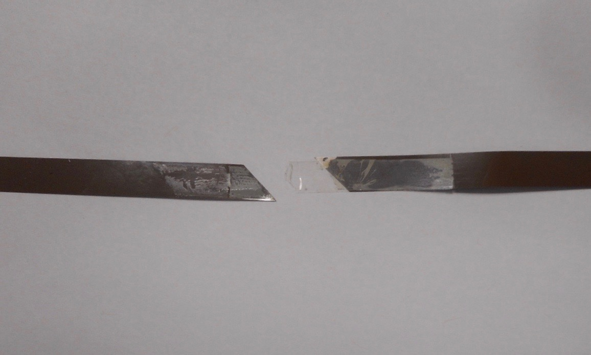
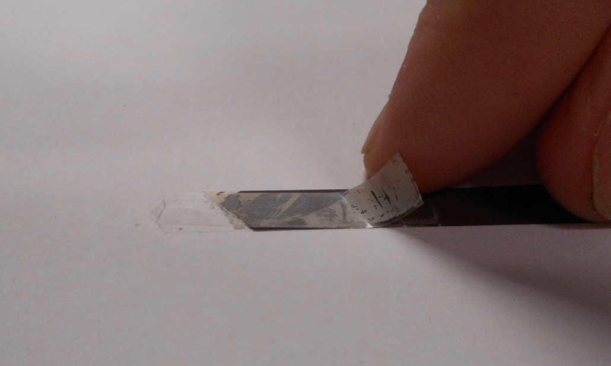
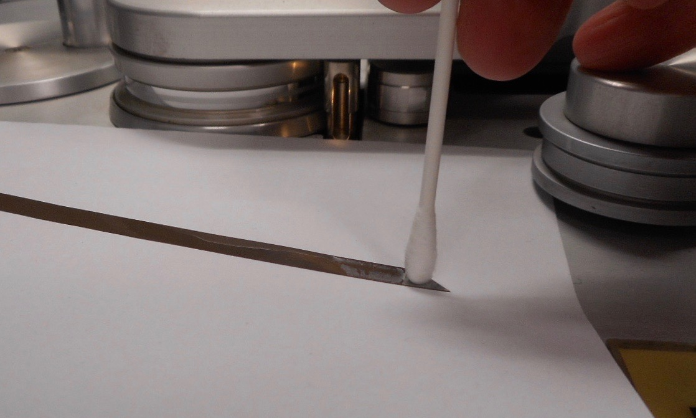
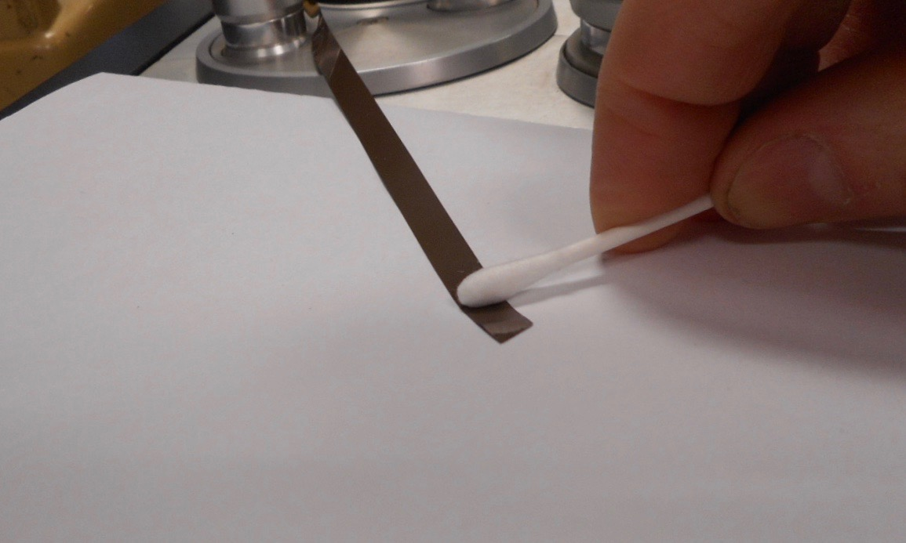
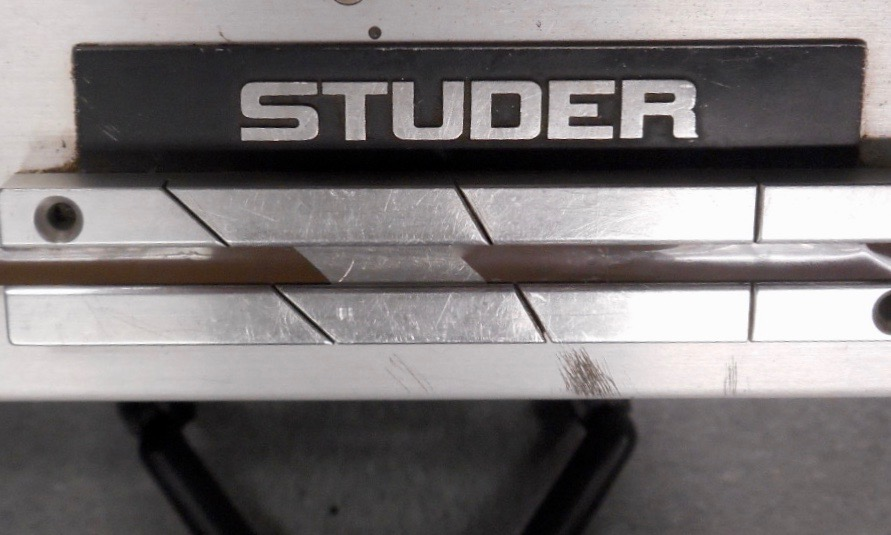
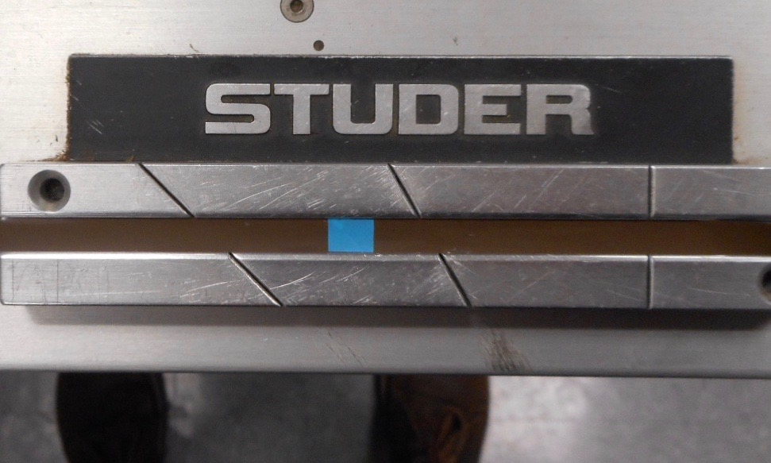

# Workflow for replacing failed splices on audio tape. 

## Overview. 
The following is a workflow for repairing failed splices on audio tape.  

Tools and supplies:

>archival-quality splicing tape  
>splicing block  
>swabs  
>solvent (ethyl alchohol)  

Note: Ethyl alchohol, or any alternate solvent, should be spot-checked on an unrecorded section of the audio tape being treated before proceeding. Test should confirm that the solvent will not alter its back-coat, base or emulsion layer. 
  

---
*Example: failed splicing tape*  
. 

---
## Workflow. 
1) Carefully remove the backing of the failed splicing tape.  

---  
*Example: splicing tape backing being removed* 
. 

---

2) Using only the tip of a swab, apply solvent and loosen the failed adhesive on the audio tape backing.  

---
*Example: solvent being applied and worked into the old adhesive*  
.   

---

3) Using only the side of the swab, in an upward rolling motion, lift the disolved adhesive off the audio tape.  Repeat steps 2 and 3, as needed.

---
*Example: old adhesive being lifted from the audio tape*  
.  

---
4) Place the cleaned audio tape in a splicing block.  Join the two pieces of audio tape and apply splicing tape; a 3/8 to 1/2-inch piece of splicing tape is usualy sufficient.  
  
  
---
*Example: both pieces of audio tape after adhesive removal placed in a splicing block with the emulsion layer facing down*  

  . 
    
*Example: splicing tape applied to the cleaned audio tape.  
  
   
--- 
 
